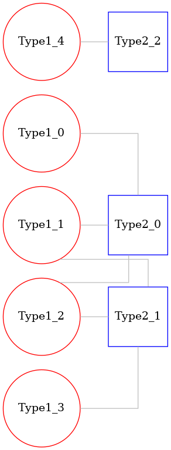
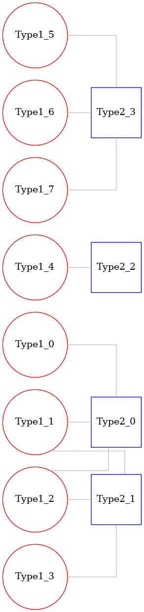
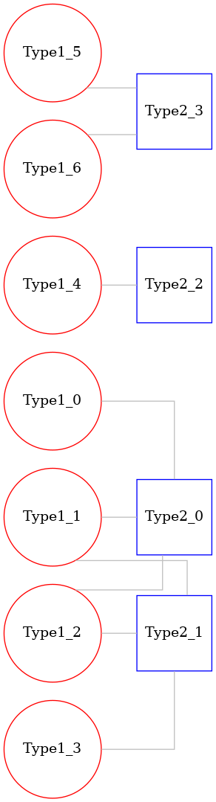
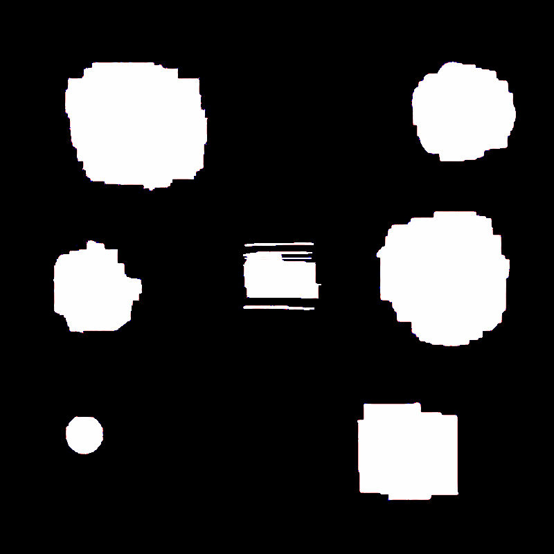
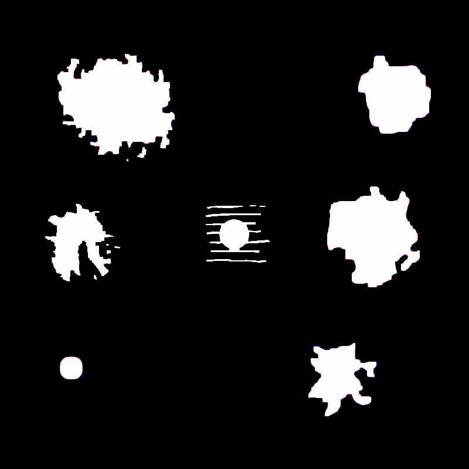
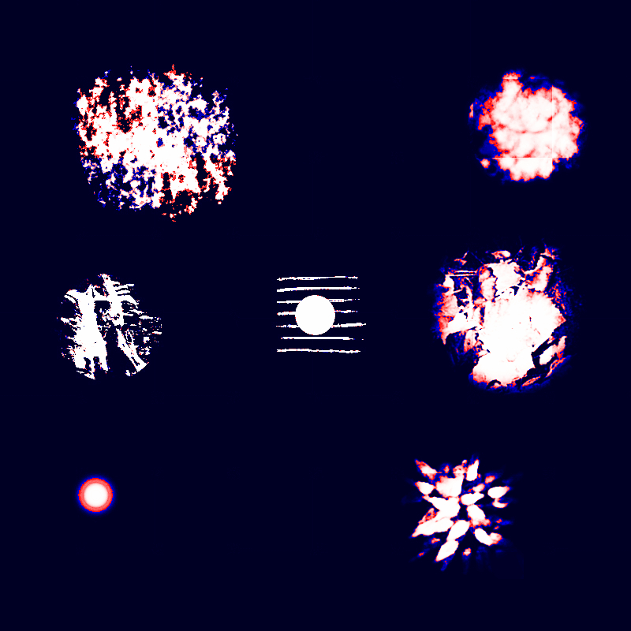
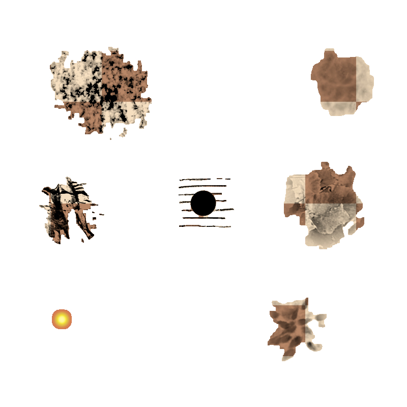
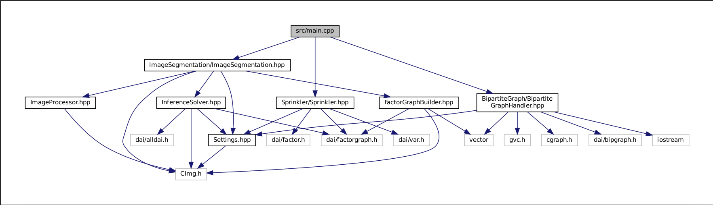

# libDAIProject

**Description and Analysis of Factor Graphs using libDAI**

## Table of Contents
- [About the Project](#about-the-project)
  - [Introduction](#introduction)
  - [Goals](#goals)
- [Repository Structure](#repository-structure)
- [Getting Started](#getting-started)
  - [Cloning the Repository](#cloning-the-repository)
  - [Running the Setup Script](#running-the-setup-script)
  - [Building the Project](#building-the-project)
  - [Development & Later Builds](#development--later-builds)
- [Usage](#usage)
  - [Command-Line Arguments](#command-line-arguments)
  - [Default Settings](#default-settings)
  - [Examples](#examples)
  - [Reason behind Invoker](#reason-behind-invoker)
- [Components](#components)
  - [Sprinkler](#sprinkler)
  - [Bipartite Graph](#bipartite-graph)
  - [Image Segmentation](#image-segmentation)
- [Scripts](#scripts)
  - [Build Scripts](#build-scripts)
  - [Utility Scripts](#utility-scripts)
- [Doxygen](#doxygen-documentation)
  - [Overview](#overview)
  - [Detailed Documentation Coverage](#Detailed-documentation-coverage)
  - [Generating Documentation](#generating-documentation)
  - [Generating PDF Documentation](#generating-pdf-documentation)

## About the Project

### Introduction
This project leverages **libDAI**, a library for discrete approximate inference in graphical models, to create and analyze factor graphs. Additionally, it incorporates **Graphviz** for graph visualization and **CImg** for image processing tasks. The project is designed to be versatile, supporting various applications such as sprinkler systems simulations, image segmentation, and bipartite graph analysis. The aim is to build a comprehensive system that not only facilitates the exploration and manipulation of factor graphs but also integrates visualization and image processing capabilities to enhance the analysis and interpretation of probabilistic models.

### Goals
- **Model Implementation**: Implement and simulate various probabilistic models using factor graphs, focusing on diverse applications like sprinkler systems, image segmentation, and network analysis.
- **Inference Analysis**: Provide robust tools for performing inference, leveraging libDAI’s capabilities to analyze results effectively across different models and scenarios.
- **Visualization and Interaction**: Utilize **Graphviz** to visualize the structure and changes within the factor graphs dynamically, enhancing the interpretability and accessibility of data.
- **Image Processing Integration**: Incorporate **CImg** for tasks requiring image manipulation and analysis, particularly for the image segmentation aspect of the project.

## Repository Structure

```plaintext
libDAIProject/
├── CImg/                               # CImg library related files
├── graphviz/                           # Graphviz library for graph visualizations
├── libDAI/                             # libDAI library related files
├── results/                            # Directory for output results
│    ├── BipartiteGraph                 # Results of Bipartite Graph(graphviz images)
│    │    └── .gitkeep  
│    ├── ImageSegmentation              # Results of Image Segmentation (including beleifs)
│    │    └── .gitkeep
│    └── Sprinkler                      # Results of Sprinkler (saved Factor graph)
│         └── .gitkeep
├── src/                                # Source files for the core application
│   ├── BipartiteGraph/                 # Bipartite graph functionality
│   │   ├── BipartiteGraphHandler.cpp
│   │   └── BipartiteGraphHandler.hpp
│   ├── ImageSegmentation/              # Image segmentation functionality
│   │   ├── FactorGraphBuilder.cpp
│   │   ├── FactorGraphBuilder.hpp
│   │   ├── ImageProcessor.cpp
│   │   ├── ImageProcessor.hpp
│   │   ├── ImageSegmentation.cpp
│   │   ├── ImageSegmentation.hpp
|   │   ├── InferenceSolver.cpp         # Inference solver for probabilistic models
│   │   └── InferenceSolver.hpp
│   ├── Sprinkler/                      # Sprinkler system functionality
│   │   ├── Sprinkler.cpp
│   │   └── Sprinkler.hpp
│   ├── main.cpp                        # Main program logic
│   ├── Settings.cpp                    # Configuration settings
│   └── Settings.hpp
├── test/                               # Test scripts and data
│   └── ImageSegmentation/              # Tests for image segmentation
│   │   ├── chess/
│   │   │   ├── chess1.jpg
│   │   │   ├── chess2.jpg
│   │   │   ├── chess3.jpg
│   │   │   ├── chess4.jpg
│   │   │   └── chess5.jpg
│   │   ├── f4u_corsair/
│   │   │   ├── f4u_corsair1.jpg
│   │   │   ├── f4u_corsair2.jpg
│   │   │   ├── f4u_corsair3.jpg
│   │   │   ├── f4u_corsair4.jpg
│   └── └── └── f4u_corsair5.jpg        
├── .gitignore                          # Specifies intentionally untracked files to ignore
├── .gitmodules                         # Git submodules for any nested git repos
├── build.sh                            # Script to build the project
├── clean.sh                            # Script to clean the build environment
├── commands.txt                        # File containing a list of commands
├── Doxyfile                            # Configuration file for Doxygen
├── invoker.py                          # Python utility script for running application
├── Makefile                            # Makefile for building the project with make
├── README.md                           # The top-level description of the project
└── setup.sh                            # Setup script for project dependencies
```

## Getting Started

To get the project up and running on your local **Linux** machine, follow these steps:

### Clone the Repository
Start by cloning the project repository to your local machine:

```bash
git clone https://github.com/kolemare/libDAIProject.git
```
This will create a directory named **libDAIProject** containing the project files.

### Run the Setup Script
    
Change to the project directory and run the setup script:
```bash
cd libDAIProject
./setup.sh
```

The `setup.sh` script will install necessary **Linux** packages and clone the submodules recursively.

###  Build the Project
When building for the first time, execute the build.sh script with the `--full` argument:
```bash
./build.sh --full
```
This ensures that the submodules are fully built before the main application to maintain dependency order.

### Development & Later Builds
Once **libDAI**, **graphviz** are built, there is no need to run `build.sh` with arguments,
after changing code or implementing new feature,
simply run `build.sh` or even write **make** in repo root to build the applciation.
Reason for this kind of procedure is based on the fact that **graphviz** is build using **CMake** while the
**libDAI** supports only **Makefile**. This kind of build approach allows developer even to make changes to existing libraries,
maybe even going towards integrating libraries directly into one another.

## Usage

The `invoker.py` script is designed to facilitate the execution of the **libDAIApp** application with various configurations and operations. It provides a command-line interface for setting up parameters for the specific tasks of image segmentation, sprinkler simulations, and bipartite graph analysis.

### Command-Line Arguments

- `operation`: Specify the operation to perform. Options are `is` for ImageSegmentation, `bp` for BipartiteGraph, and `sp` for Sprinkler.
- `image_set` (optional for `is` operation): Specify the image set to use. Options are `chess` and `f4u_corsair`.
- `image_num1` (optional for `is` operation): Specify the first image number from the set.
- `image_num2` (optional for `is` operation): Specify the second image number from the set.
- Various optional parameters to override default settings such as `J`, `thmin`, `thmax`, `scale`, `pbg`, `method`, `maxiter`, and `tol`.

### Default Settings

The `invoker.py` script comes with a set of predefined default settings that can be customized as needed. These settings are applied when corresponding arguments are not explicitly provided by the user. Below are the settings and their default values:

- `J` (Pairwise interaction strength): Default is `2.4`
- `thmin` (Minimum threshold for local evidence strength): Default is `-3.0`
- `thmax` (Maximum threshold for local evidence strength): Default is `3.2`
- `scale` (Scale factor for pixel value transformations): Default is `40.0`
- `pbg` (Percentage of background in an image): Default is `90.0`
- `method` (Inference method description): Default is `BP[updates=SEQMAX,maxiter=100,tol=1e-9,logdomain=0]`
- `maxiter` (Maximum number of iterations for inference): Default is `100`
- `tol` (Tolerance level for convergence in inference): Default is `1e-9`

You can override these defaults by passing new values as command-line arguments. For example:

```bash
python3 invoker.py is chess 1 3 --J 1.8 --thmin -2.0 --thmax 2.5 --scale 20.0
```

### Examples

To perform an image segmentation operation using the chess image set with image numbers 1 and 3:

```bash
python3 invoker.py is chess 1 3
```

To execute the bipartite graph analysis:
```bash
python3 invoker.py bp
```
To run the sprinkler system simulation:
```bash
python3 invoker.py sp
```

### Reason behind Invoker
Using the `invoker.py` script streamlines the process of running the **libDAIApp** application.
Typically, executing the application with the desired settings requires a lengthy and complex command that might look like this:

```bash
./libDAIApp -op ImageSegmentation -i1 test/ImageSegmentation/chess/chess1.jpg -i2 test/ImageSegmentation/chess/chess3.jpg -o1 results/ImageSegmentation/local_evidence.jpg -o2 results/ImageSegmentation/magnetizations.jpg -blf results/ImageSegmentation/belief -J 2.4 -thmin -3.0 -thmax 3.2 -scale 40.0 -pbg 90.0 -method BP[updates=SEQMAX,maxiter=100,tol=1e-9,logdomain=0] -maxiter 100 -tol 1e-9
```
Such commands are not only inconvenient to write but also prone to errors. The `invoker.py` script addresses this problem by significantly reducing the number of arguments a user has to manually input. Instead of meticulously typing out each parameter and its value, users can simply specify operation types and image sets, while the script intelligently applies default settings and constructs the command accordingly. This makes for a more user-friendly experience, allowing for quicker and more efficient command execution.


## Components

Current implementation is split into 3 distinctive features:
1. **Sprinkler**
2. **BipartiteGraph**
3. **ImageSegmentation**

### Sprinkler

The Sprinkler module in the **libDAIProject** implements a Bayesian network simulation of a classic probabilistic graphical model often used to demonstrate causal reasoning. The Sprinkler model includes four variables representing common weather and garden conditions: **Cloudy**, **Sprinkler**, **Rain**, and **Wet Grass**. Each variable is binary, capturing the presence or absence of each condition.

The implementation sets up the Bayesian network with conditional probabilities linking these variables to model how likely it is that the grass is wet because of either the sprinkler or rain, given whether or not it is cloudy. This setup involves constructing a factor graph where the nodes represent the probabilities of different states of these variables and their dependencies.

Here's what's achieved with this implementation:

- **Network Initialization**: Variables for **Cloudy**, **Sprinkler**, **Rain**, and **Wet Grass** are created with binary states.
- **Conditional Probabilities**: The network is structured with conditional probabilities such as the likelihood of the sprinkler being on given it is cloudy, or rain given cloudy conditions.
- **Factor Graph Construction**: A factor graph is constructed tying all these probabilities together, allowing for complex inference about the network.
- **Probability Computations**: The implementation calculates joint probabilities of all variables and specific conditional probabilities like the probability of the sprinkler being on given that the grass is wet.

This model is not only foundational for learning Bayesian networks but also serves as a practical demonstration of libDAI's capabilities in representing and manipulating probabilistic models with underlying graphical structures.

### Bipartite Graph

The BipartiteGraph component of the **libDAIProject** manages and manipulates bipartite graphs. This module is capable of initializing a bipartite graph with predefined sets of nodes and edges, and it provides functionalities to dynamically add and remove both nodes and edges. Key operations such as checking connectivity between nodes are implemented to ensure the graph's integrity and usability in various scenarios.

The component integrates with **Graphviz** for visualization purposes, allowing it to graphically represent the structure and current state of the bipartite graph after any modifications. This visualization aids in better understanding the graph's layout and is particularly useful for presentations or detailed analysis. Each operation, such as adding or removing nodes and edges, is accompanied by real-time updates to the visualization, showcasing the direct impact of these actions on the graph structure. This dynamic representation is saved as an image file, which can be referenced or utilized in further documentation or analysis tasks.

#### Example of visualized graphs
These bipartite graphs were visualized when running the Bipartite Graph module, by integrating **graphviz** these images represent the current state and shape
of Bipartite Graph during execution.
<p align="center">
  
  
  
</p>

### Image Segmentation

The Image Segmentation component of the **libDAIProject** is a comprehensive module designed to handle the segmentation of images by analyzing the differences between two input images and applying factor graph-based inference. This module leverages the powerful capabilities of **libDAI** to model relationships between image pixels, employing the **Ising** model to represent interactions and transformations within the images.

#### Process Overview
1. Image Reading and Display:
The process begins with the loading of two input images. These images are then displayed to provide a visual confirmation of the data being processed.
2. Difference Calculation:
The absolute differences between the corresponding pixels of the two images are calculated. This step highlights the areas of change and is crucial for identifying regions of interest in the segmentation process.
3. Histogram Analysis and Thresholding:
A histogram of the first image is calculated to determine the distribution of pixel intensities. This analysis aids in setting a dynamic threshold that adapts based on the image content, particularly focusing on distinguishing between background and foreground elements.
4. Factor Graph Construction:
Using the differences and the histogram analysis results, a factor graph is constructed. This graph models the pixel intensities as binary states, where the factors represent the interaction strengths (influenced by the **Ising** model parameters) and the transformations dictated by the thresholding process.
5. Evidence Generation:
An evidence image is generated concurrently with the factor graph. This image visually represents significant transitions and intensities, serving as a preliminary result that indicates potential areas of segmentation.
6. Inference Execution:
The core of the segmentation process is the execution of inference algorithms on the constructed factor graph. This step iteratively adjusts the beliefs about pixel states, refining the segmentation results based on probabilistic modeling.
7. Result Visualization and Saving:
The final segmentation results are visualized and saved. This not only provides immediate feedback on the effectiveness of the segmentation but also archives the outcomes for further analysis or use.
8. Technical Details
The segmentation process is finely tuned through various parameters such as the coupling constant (**J**), minimum and maximum thresholds for intensity (**th_min**, **th_max**), and the scaling factor for the hyperbolic tangent function used in threshold calculations. These parameters allow the adaptation of the segmentation process to specific characteristics of the input images, such as varying lighting conditions or noise levels.
9. Additionally, the process involves detailed logging at each step to ensure traceability and to facilitate debugging. The graphical outputs at different stages help in understanding the progression of the segmentation, making it easier to identify and adjust any steps that may not perform as expected.
10. This component is essential for applications requiring detailed analysis of changes between images, such as medical imaging, surveillance, and any other field where precise image analysis is crucial. The integration of image processing techniques with probabilistic graphical models provides a robust approach to tackling complex segmentation tasks.

#### Example of running
1. **Beleif Images (Iterations: 1,2 and FINAL)**  
These images represent the state of the beliefs at various iterations of the inference process. Each image, shows the probabilistic beliefs about the segmentation states of pixels at a specific iteration. As the inference progresses, these images evolve, showing how the algorithm refines its guesses about which parts of the image belong to the foreground and which to the background. The changes in these images across iterations visually demonstrate the convergence of the inference algorithm towards a stable state. In this example image **chess1** and **chess3** were used. These images are available in the repository.
<p align="center">
  
  
  
</p>

2. **Local Evidence**  
The local evidence image is a crucial output that highlights significant transitions or features within the image according to the computed thresholds and the initial factor graph setup. This image helps in identifying areas with substantial changes in intensity, which are likely candidates for edges or boundaries in the segmentation task. The local evidence acts as a map guiding the inference process by emphasizing regions where the pixel states are most uncertain and thus require careful evaluation by the inference algorithm.
<p align="center">
  
</p>

3. **Magnetization Result**  
At the conclusion of the inference process, the magnetization result image is produced. This image represents the final segmentation output, displaying the foreground-background segmentation as determined by the final beliefs of the factor graph. Pixels believed to belong to the foreground are typically highlighted in a distinct color or intensity, differentiating them sharply from the background. This image is the culmination of the iterative refinement process depicted in the belief images and is influenced by the local evidence.
<p align="center">
  
</p>

## Scripts

### Build Scripts
1. **`build.sh`**
This script serves as a versatile tool for building and maintaining the **libDAIProject**. It offers functionality to clean, configure, and build both **libDAI** and **graphviz**, as well as the main application, with various options tailored to different stages of the development cycle.
The script can be run with the following options:  
`--clean`: Cleans **libDAI** and **graphviz**, reverting them to their original git state, removes all build artifacts, and prepares the environment for a clean build.  
`--full`: Configures the Makefile for **libDAI**, builds **libDAI** and **graphviz**, and prepares everything necessary for a full rebuild of the application.  
`none`: If no arguments are provided, the script cleans the application build and then rebuilds the application only.
2. **`clean.sh`**
This script is designed to thoroughly clean the project environment, including reverting submodules to their original state and removing build files. It's particularly useful for maintaining a clean and predictable development environment, especially before major changes or new integrations.


### Utility Scripts
1. **`setup.sh`**
Git Submodules Update: The script begins by ensuring that all Git submodules are initialized and updated recursively. This step is crucial for projects that depend on external libraries and frameworks managed as submodules, ensuring that all nested submodules are also initialized and updated.
Installing Dependencies: The script uses apt-get to update the package listings and then installs several packages essential for building and running the project. These packages include compilers, libraries for graph operations, options handling, unit testing, arbitrary precision arithmetic, image processing, and additional tools for document generation and image manipulation. The specific packages installed are:  
``g++``: The GNU C++ compiler.  
``make``: Utility for managing package compilation.  
``doxygen``: Tool for generating documentation from annotated C++ sources.  
``graphviz``: Software for drawing graphs specified in DOT language scripts.  
``libboost-dev`` and related: Boost libraries that provide support for tasks and structures such as program options handling, graphs, and unit tests.  
``libgmp-dev``: Library for arbitrary precision arithmetic.  
``cimg-dev``: C++ library for image processing.  
``imagemagick`` and ``libmagickcore-dev``: A software suite to create, edit, compose, or convert bitmap images.  
``libharfbuzz-dev``: Text shaping library.  
``texlive-latex-extra``: LaTeX typesetting system and extra packages.

## Doxygen Documentation

### Overview
This project employs **Doxygen** for the creation of documentation. All classes, methods, and significant code structures are annotated following Doxygen's conventions to support this process. Doxygen is adept at extracting these comments and assembling a comprehensive documentation set in a variety of output formats, such as **HTML** and **LaTeX** for PDF documents.  

Representation of project dependencies:
<p align="center">
  
</p>

### Detailed Documentation Coverage
**Doxygen** annotations cover descriptions, parameter details, return values, and notable exceptions or special conditions. This extensive coverage ensures all code elements are well-documented, promoting maintainability and enhancing future project scalability.

### Generating Documentation
To generate documentation navigate to your project's root directory and invoke **Doxygen** with the project's configuration file:
```bash
doxygen Doxyfile
```
This will generate the documentation in the outputs specified within the `Doxyfile`, including **HTML** and **LaTeX**.

### Generating PDF Documentation
For a **PDF** version of the documentation, ensure **LaTeX** is installed on your system. After generating **LaTeX** files with **Doxygen**, compile them into a **PDF** with:
```bash
cd docs
cd latex
make
```
The result is a **PDF** document that can be viewed with any standard viewer.
For further reading generated pdf is available in the repository. [Download PDF](/readme/libDAIProject.pdf)
